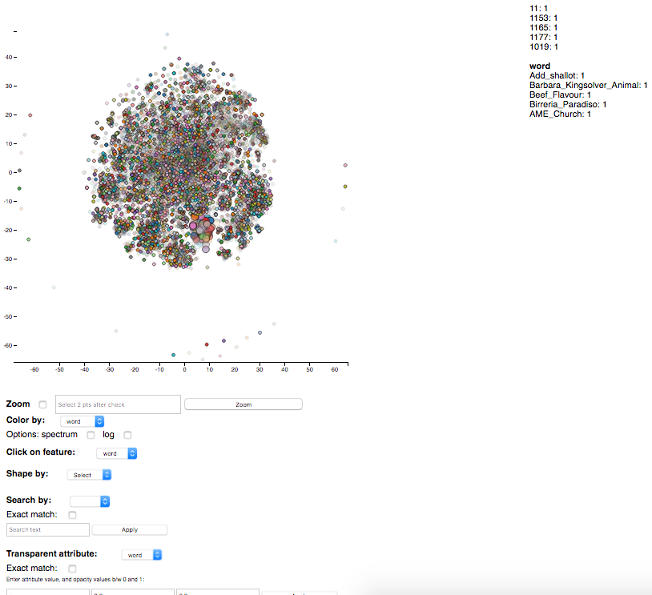

# Using d3-scatterplot with gzipped files on server

### Motivation:
This tutorial will teach users how to use the d3-scatterplot library with gzip-compressed data files. It is separated into two parts, so it can serve as a standalone d3-scatterplot tutorial as well as a guide for sending gzip-compressed data from your server to client-side JavaScript to work with D3.js in any library.

### Background:
The d3-scatterplot library allows users to visualize and interact with their 2D datasets.



It has features such as zooming into an area, controlling transparency of points that match or don't match the query, searching for datapoint(s) by column value, spatially selecting points for a summary of their values, etc. It uses D3.js, which is a popular JavaScript library used for interactive data visualizations in web browsers. d3-scatterplot makes the interactive visualization generalizable to any standard 2-dimensional dataset, and delegates exploration of secondary dimensions to features such as color and transparency.

In transferring data files from server to client using this library, I was already using gzip technology to make transferring large files faster. However, the public directory of the server started to run out of space.

**Solution 1:** I asked some career software engineers about how I could save space on the server (perhaps also using gzip). Their answers were unanimously, I don't see why this is a problem. Just allocate or buy more space!

**Solution 2:** Well, anyway. Say that wasn't a possibility (not my grant money!). Can I gzip the file on the server, to save space, not just to make HTTP transfers faster? Sure, but renders d3.tsv(), and all other standard ways of reading in data for D3, useless for loading files into JavaScript. We'd have to read in the data ourselves after first decompressing the file.

I'll first do a quick walk through for how to use the d3.js library as it stands first, before covering how to modify the source code to allow for loading in gzip data into JavaScript.

## Part 1: Using d3-scatterplot

Locally:

1. clone the GitHub repo to your local machine `git clone https://github.com/CAHLR/d3-scatterplot.git`
1. in that directory, place a tab separated file with two dimensional coordinates (x,y) and any number (0+) of other columns. An example file would look like:
```
    word	x	y
0	whiteness	41.001522	-32.97127
1	instruct	-15.368904	57.675983
2	created	3.5565212	33.84917
3	DTD	-10.029182	51.35688
4	jumps	-5.9975615	-14.413481
```
Note: the index is optional. Works with or without.

1. in that new directory, start up a local web server: `python -m http.server`

1. visit http://localhost:8000/plot.html?dataset=name_of_dataset.txt

For server use:

Do the same, but clone the GitHub repo to your public directory.

## Part 2: Modifying d3-scatterplot to save server space

All following modifications will be made to `plot.html`.

1. Under the section `<!-- These javascript modules are used to draw the interactive plot  -->` add in one more import module: `<script src="gunzip.min.js"></script>`

1. Add these two functions where any d3.tsv() calls can access them (these two functions are based on dougbtv.com/2014/04/16/decompressing-gzipped-with-javascript AND stackoverflow.com/questions/33595168/variable-outside-onload-xmlhttprequest):

```javascript
function createXhrRequest(request_url, callback) {
        var req = new XMLHttpRequest();
        req.open('GET', request_url);
        // You gotta trick it into downloading binary.
        req.overrideMimeType('text\/plain; charset=x-user-defined');
        req.onload = function () {
            // When the data is done downloading, pass in the response to the callback (loadCompressedASCIIFile)
            callback(null, req.responseText, request_url);
        }
        req.onerror = function() {
            // If there is an error in download, get loadCompressedASCIIFile to address it
            callback(xhr.response);
        }
        req.send(null);
}
var loadCompressedASCIIFile = function(err, response, request_url) {
        if (err) {
            console.log("[ERROR] Error requesting file!");
            return "";
        }

        // Save each character to bytes, after masking higher-order values.
        var bytes = [];
        for (var fileidx = 0; fileidx < response.length; fileidx++) {
            var abyte = response.charCodeAt(fileidx) & 0xff;
            bytes.push(abyte);
        }

        // Utilize the zlib library to decompress the gzipped file.
        // Requires: http://goo.gl/PIqhbC [github]
        // (remove the map instruction at the very end.)
        var  gunzip  =  new  Zlib.Gunzip ( bytes );
        var  plain  =  gunzip.decompress ();
        // Return the ascii string from all those bytes.
        return String.fromCharCode(plain);
};
```

1. Where the code previously loads in data with
```javascript
d3.tsv(dataset, function(data) {
yourtextvariablename = text.map( Object.values );
```
replace that with
```javascript
yourtextvariablename = createXhrRequest(bowfile, loadCompressedASCIIFile);
```
This tells the code to load in the data with the two functions we defined above, instead of the built-in `d3.tsv()`.

1. [Optional] If you want to still keep the ability to load non-gzipped files, you can utilize the url arguments and add in statements like
```javascript
if ("needs_unzip" in dicts && dicts["needs_unzip"] == "true") {
```

and put the above code inside, while keeping the original `d3.tsv` code in the else statement. Just make sure to specify `&needs_unzip=true` in the url whenever you do want to load in gzipped files.

That's it! However, turns out, Solution 1 is much more efficient. So Solution 2 is really only for people with limited server space working with small-medium datasets.
